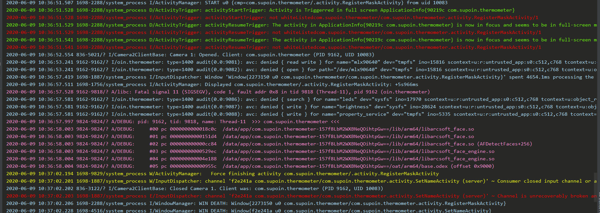
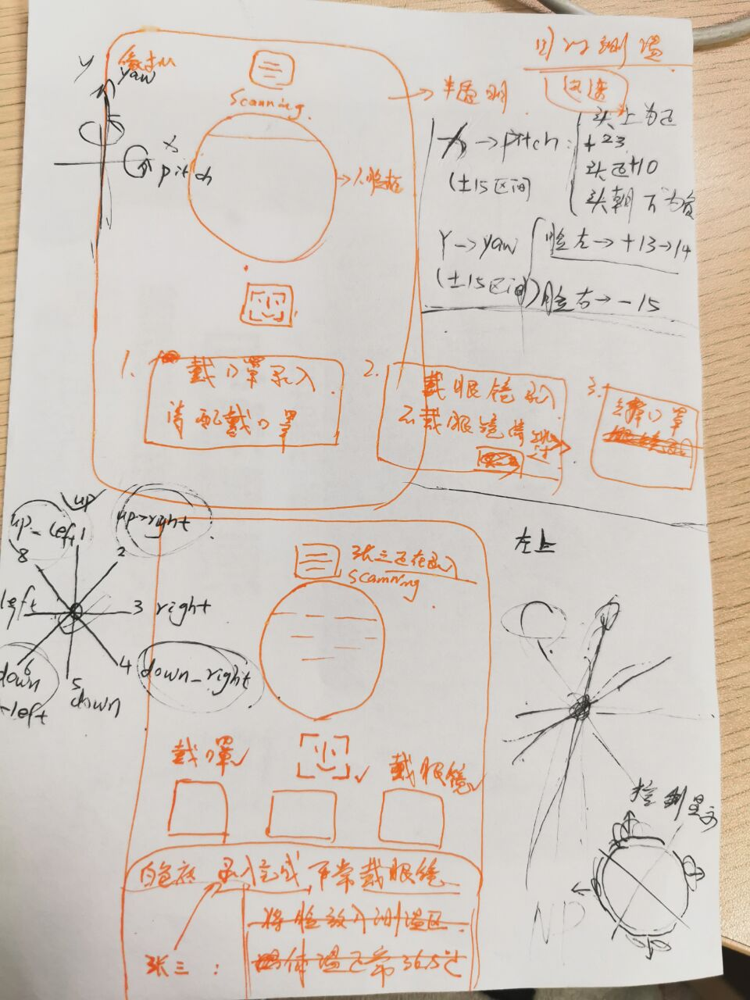
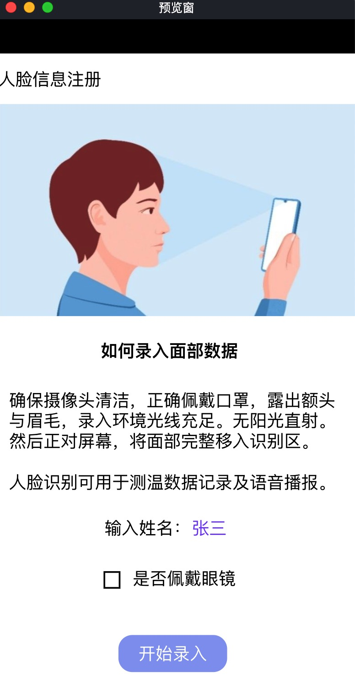
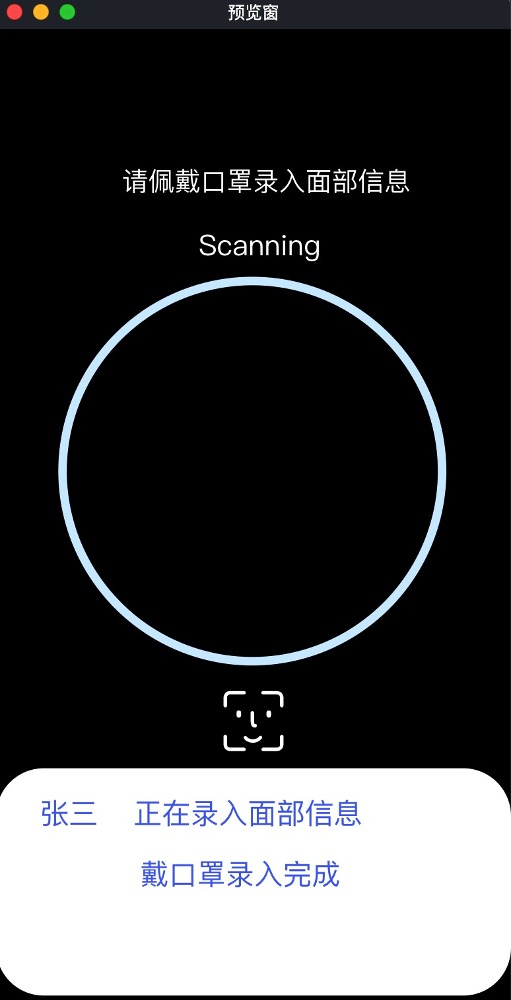
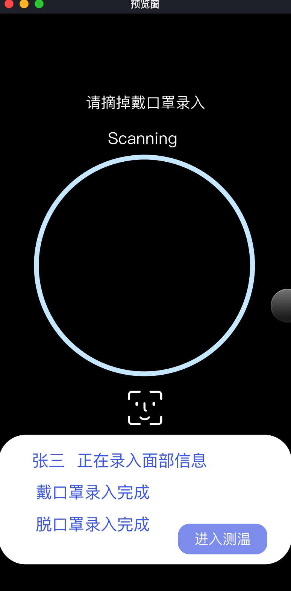
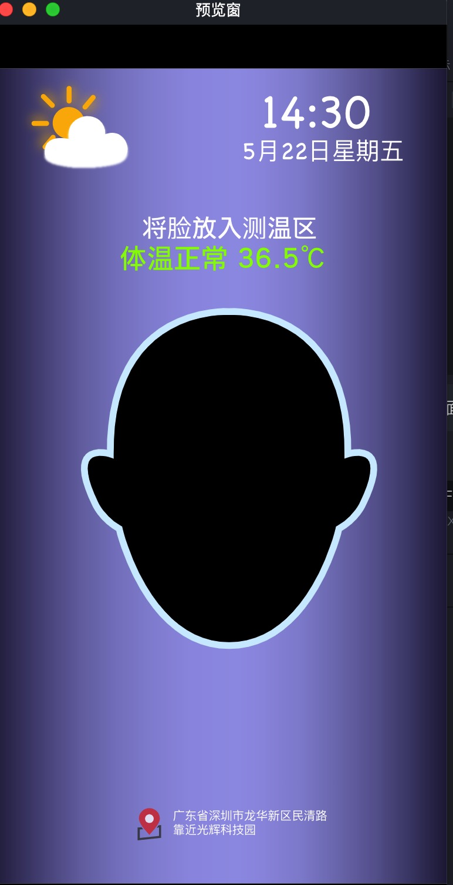
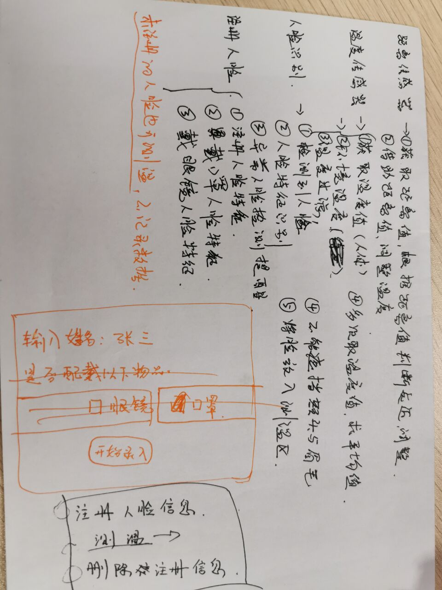
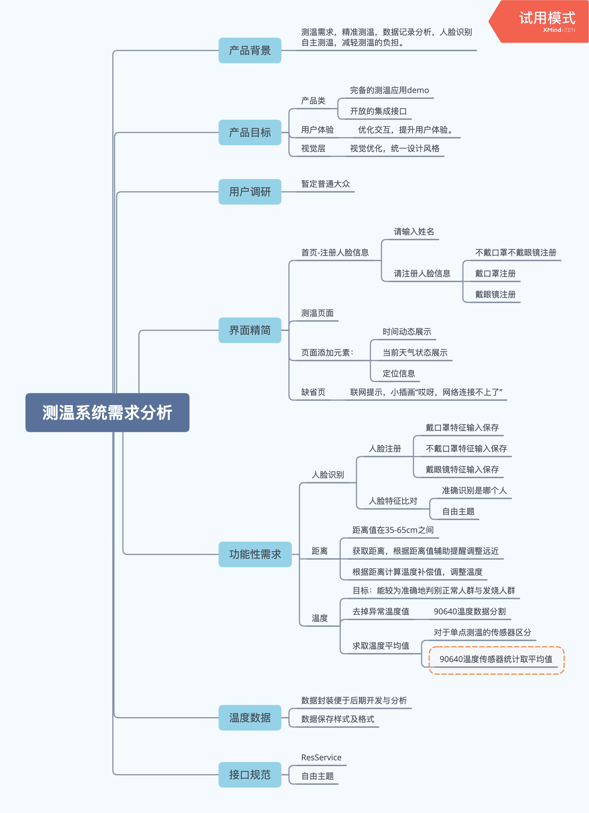

# Thermometer

**2020年的温度计实现过程记录**

***TO DO LIST***

**日期:2020-06-12**

* 1. 删除注册人脸信息返回状态提示
* 2. 增加614测温接口
* 3. 办公室录入人脸过程发现问题:
     a. 录入人脸时的环境光线影响;
     b. 人脸胖瘦区别导致录入时的难易程度;
     c. 最好在确定测温地点处录入人脸信息
     d. 增加了录入人脸信息的难度，降低了识别难度;
     e. 相似的调太高，导致人录入时的表情与测温时的表情不一致，
        睁眼闭眼这种区别都可能导致无法识别这个人;
     f. 对于有些人来说，这次的改动优化了，有些人觉得比上次更难了;

***

***已处理***

**日期：2020-06-12**

* 测温状态显示
* maxSimilar>0.98f,避免未注册的人识别成其他人
* 删除无效的页面
* 更新readme文件

**日期：2020-06-11**

* 测温状态显示
* maxSimilar>0.98f,避免未注册的人识别成其他人
* 删除无效的页面
* 更新readme文件

***

**日期：2020-06-10**

* 录入人脸页面优化
* 修改文件写入格式
* 增加定位信息显示
* camera 不能release
* 不能在setNameActivity中执行Systtem.exit(0)
* 解决崩溃问题
* 修复星期二
* 解决冲突
* 细节处调整
* 添加了获取定位的API
* 温度高低给出提示

***

**日期：2020-06-09**

* 温度低于35时，脸部未放在中心测温区域，提示将脸放入测温区
* 温度大于37.3℃时，提示温度偏高，调整再次测温，一次两次偏高不代表发烧
* 程序只给出测量结果，不做评判
* 温度偏高时提示语改为红色显示
* 设备加入中文输入法
* 异常信息:出现人脸识别库报错问题导致程序异常关闭

***

**日期：2020-06-08**

* 功能完善
* 过滤异常温度数据
* 增加测温数据写入文件
* 代码优化
* 添加了时间接口

***

**日期：2020-06-05**

* 录入人脸中途退出时stopSaveFace
* 调整人脸识别提示效果

***

**日期：2020-06-04**

* 动效风火轮转起来
* 修改动画
* TO DO LIST

***

**日期：2020-06-03**

* 注册人脸调整
* 带口罩不带口罩人脸信息保存成功
* 测温语音提示调整
* 调整相似度度0.85,提示优化
* 注册人脸信息调整
* 添加删除人脸的功能
* 修改了录入人脸方向的顺序
* 添加了释放TTS资源的方法
* 修复带口罩无法录入的BUG
* 增加删除注册人脸信息操作
* 添加README内容
* 修改readme.md

***

**日期：2020-06-02**

* 调整人脸识别算法
* 修改接口
* Make 'DataCallback' static
* 临时提交
* 修改注册人脸API

***

**日期：2020-06-01**

* 完成服务端所有开发
* 基本完成服务逻辑的开发

***

**日期：2020-05-30**

* 周末叫上大佬一起代码实现接口
* 增加注册人脸信息提示
* 完成接口定义
* 完善服务
* 修改页面

***

**日期：2020-05-30**

* 周末叫上大佬一起代码实现接口
* 完成接口定义

***

**日期：2020-05-29**

* 跟大佬催促下开始编写服务代码

***

**日期：2020-05-28**

* UI复用
* AndroidManifest修改
* 解决提交冲突
* 页面跳转优化，相机释放

***

**日期：2020-05-26 至 2020-05-27**

* 添加数据资源服务
* 添加datautils

***

**开始码代码的日子**
**日期：2020-05-25**

* 🐖队友默默地不讲一句，开始服务添砖加瓦，人讲话🐖听的懂啦，给他提需求就是了
* 代码是画笔，笨拙地画出简单的界面，还是觉得用ipad画画最爽啦

***

**产品原型设计**
**日期：2020-05-22 至 2020-05-25**

* 第一步画出构思的草图

* 接着将想法用 ProtoPie（MAC上的收费原型工具）画出来
* 不同的页面构思，功能模块
* 注册页面 > 录入人脸说明及姓名录入  > 戴口罩录入人脸信息  > 摘掉口罩录入人脸信息
      

* 测温页面
* 测温页面前期想的太多

***

**产品需求分析**
**日期：2020-05-21 至 2020-05-22**

* 第一步草稿上列出相关的功能模块及需求项
* 这部分因为前面有开发过一版简易的demo，可作为参考进行分析总结:

* 接着用思维导图工具将草稿列出的大致功能模块细化分析:

***

**产品化项目立项**
**日期：2020-05-21 18:56**

* 与老大及开发搭档讨论，明确项目产品化需求
* 项目起名Thermometer（温度计）
* 建立AS项目，推到gitLab
* Init Project
* 收拾好心情，搞起!
*